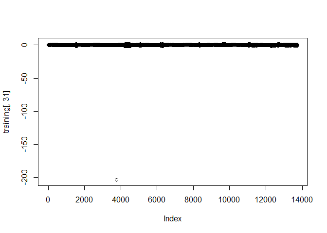
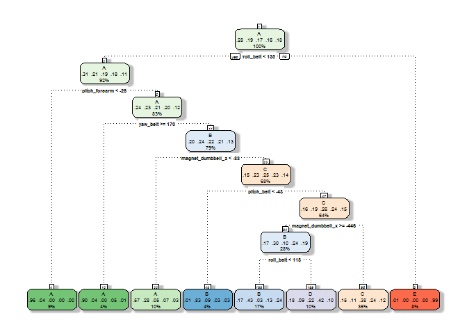
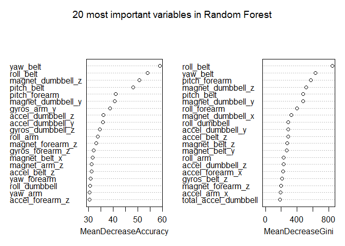
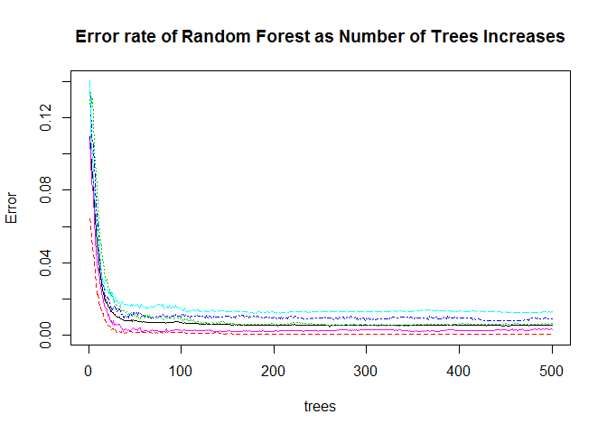

# Automated Activity Recognition of Weightlifting Exercises

## Summary

In this report, we try to predict how well 6 different participants performed a weightlifting excercise. The participants were asked to perform one set of 10 repetitions of the Unilateral Dumbbell Biceps Curl in five different ways. Data was obtained from accelerometers on the belt, forearm, arm, and dumbell of 6 participants. More information can be found here: [Weight Lifting Exercises Dataset](http://groupware.les.inf.puc-rio.br/har). Our objective is to predict how the participants did the exercise using the data obtained from the accelorometers. This is a classification problem with 5 possible outcomes corresponding to the five different ways in which the particopanmts executed the exercise. We train a random forest on a training set and find that it performs very well on our cross-validation set. 

## Data Processing

The data used for this project is from the [Weight Lifting Exercises Dataset](http://groupware.les.inf.puc-rio.br/har). First, we load both the training and testing data. We treat '#DIV/0!' as NAs

```r
if (!file.exists("pml-training.csv")){
    fileUrl<-"https://d396qusza40orc.cloudfront.net/predmachlearn/pml-training.csv"
    download.file(fileUrl, "pml-training.csv",mode="wb")
}  

if (!file.exists("pml-testing.csv")){
    fileUrl<-"https://d396qusza40orc.cloudfront.net/predmachlearn/pml-testing.csv"
    download.file(fileUrl, "pml-testing.csv",mode="wb")
}  
trainData <- read.table("pml-training.csv", header = TRUE, sep = ",", na.strings = c("NA" , "#DIV/0!"))
testData <- read.table("pml-testing.csv", header = TRUE, sep = ",", na.strings = c("NA" , "#DIV/0!"))
```

The test data is set aside for later use. 

Next, we load the libraries that we need:

```r
library(caret)
library(dplyr)
library(rpart)
library(rattle)
library(randomForest)
```

In order to perform cross-validation on our classification algorithm, we split the training data into a real training set and a cross-validation set. This will allow us to evaluate our prediction algorithm on the cross-validation data set after training it on the cross-validation set. We could have chosen more sophisticated cross validation methods, but here we keep 70% of the data for training and 30% for cross validation. We set the seed for reproducibility purposes. 

```r
set.seed(123)
inTrain <- createDataPartition(y=trainData$classe,p=0.70, list=FALSE)
training <- trainData[inTrain,]
crossvalidation <- trainData[-inTrain,]
```

Investingating the training data, we note that there are many columns/variables in the data set that have a lot of missing data. 

```r
na_vector<-sapply(training, function(x) sum(is.na(x)))
length(na_vector[na_vector>0])
```

```
## [1] 100
```

We remove all these columns from the data set before training our prediction algorithm. 

```r
training <- training %>% select(one_of(names(na_vector[na_vector==0])))
```

We also note that several variables should be excluded from the prediction algorithm as they are not meaningful. These include the variables X , user_name, three 'timestamp' variables, and two 'window' variables.

```r
training <- training %>% select(-c(X,user_name,raw_timestamp_part_1,raw_timestamp_part_2,cvtd_timestamp,new_window,num_window))
dim(training)
```

```
## [1] 13737    53
```

After removing the variables that contain many NAs and the variables that are not meaningful for prediction, we are left with 52 variables or features plus the 'classe' variable that we are trying to predict.

We apply the same transformations to our cross-validation set and our test set.

```r
crossvalidation <- crossvalidation %>% select(one_of(names(na_vector[na_vector==0])))
crossvalidation <- crossvalidation %>% select(-c(X,user_name,raw_timestamp_part_1,raw_timestamp_part_2,cvtd_timestamp,new_window,num_window))
```


```r
na_vector_test <- na_vector
names(na_vector_test)[160] <- names(testData)[160]
testData <- testData %>% select(one_of(names(na_vector_test[na_vector_test==0])))
testData <- testData %>% select(-c(X,user_name,raw_timestamp_part_1,raw_timestamp_part_2,cvtd_timestamp,new_window,num_window))
```

After exploring the training data, we discovered a strange outlier.


This outlier also occurs in two other variables at the same index level

```r
which.min(training[,31])
```

```
## [1] 3767
```

```r
which.max(training[,33])
```

```
## [1] 3767
```

```r
which.max(training[,46])
```

```
## [1] 3767
```

We filter this observation out from the training set

```r
training <- training[-which.min(training[,31]),]
```

## Training a Classification Algorithm

Now, we are ready to try different classification algorithms. We fix the seed again for reproducibility purposes. First we try a simple classification tree. We use all 52 features in our training set to predict the 'classe' variable.

```r
set.seed(321)
modFit_tree <- train(classe ~ .,method="rpart",data=training)
```


Now that we have trained the classification tree, let's see how it performs on our cross-validation data set. 

```r
pred_tree <- predict(modFit_tree,newdata=crossvalidation)
confusionMatrix(pred_tree, crossvalidation$classe)
```

```
## Confusion Matrix and Statistics
## 
##           Reference
## Prediction    A    B    C    D    E
##          A 1061  235   27   64   13
##          B  163  631   42  133  281
##          C  341  230  819  509  247
##          D  102   43  138  258   60
##          E    7    0    0    0  481
## 
## Overall Statistics
##                                          
##                Accuracy : 0.5523         
##                  95% CI : (0.5394, 0.565)
##     No Information Rate : 0.2845         
##     P-Value [Acc > NIR] : < 2.2e-16      
##                                          
##                   Kappa : 0.4373         
##  Mcnemar's Test P-Value : < 2.2e-16      
## 
## Statistics by Class:
## 
##                      Class: A Class: B Class: C Class: D Class: E
## Sensitivity            0.6338   0.5540   0.7982  0.26763  0.44455
## Specificity            0.9195   0.8696   0.7269  0.93030  0.99854
## Pos Pred Value         0.7579   0.5048   0.3816  0.42928  0.98566
## Neg Pred Value         0.8633   0.8904   0.9446  0.86639  0.88864
## Prevalence             0.2845   0.1935   0.1743  0.16381  0.18386
## Detection Rate         0.1803   0.1072   0.1392  0.04384  0.08173
## Detection Prevalence   0.2379   0.2124   0.3647  0.10212  0.08292
## Balanced Accuracy      0.7767   0.7118   0.7626  0.59897  0.72154
```

The accuracy of the classification tree is only 55% and many exercises are classified incorrectly. Perhaps, we can do better if instead we use a random forest where we train many different trees (using bootstrapping) with different tree depths (by randomly sampling variables as potential candidates at each split of the tree). We train 500 trees for our random forest.


```r
modFit_rf <- randomForest(classe ~ ., data=training,importance=TRUE,ntree = 500)
varImpPlot(modFit_rf,n.var=20,main="20 most important variables in Random Forest")
```



We see that 'roll belt', 'yaw belt', 'pitch belt', 'magnet dumbbell z', and 'magnet dumbbell y' are the 5 most important variable in classifying the weightlifting excersises. Let's see how adding trees helps in reducing the error rates of our classification algorithm. 


We see a steep drop off initially and after training about 50 trees or so, the error rate stabilizes. Next, let's see how the random forest performs on our cross-validation set:

```r
pred_rf <- predict(modFit_rf, newdata=crossvalidation)
confusionMatrix(pred_rf, crossvalidation$classe)
```

```
## Confusion Matrix and Statistics
## 
##           Reference
## Prediction    A    B    C    D    E
##          A 1673    5    0    0    0
##          B    1 1134    9    0    0
##          C    0    0 1017   14    0
##          D    0    0    0  949    0
##          E    0    0    0    1 1082
## 
## Overall Statistics
##                                           
##                Accuracy : 0.9949          
##                  95% CI : (0.9927, 0.9966)
##     No Information Rate : 0.2845          
##     P-Value [Acc > NIR] : < 2.2e-16       
##                                           
##                   Kappa : 0.9936          
##  Mcnemar's Test P-Value : NA              
## 
## Statistics by Class:
## 
##                      Class: A Class: B Class: C Class: D Class: E
## Sensitivity            0.9994   0.9956   0.9912   0.9844   1.0000
## Specificity            0.9988   0.9979   0.9971   1.0000   0.9998
## Pos Pred Value         0.9970   0.9913   0.9864   1.0000   0.9991
## Neg Pred Value         0.9998   0.9989   0.9981   0.9970   1.0000
## Prevalence             0.2845   0.1935   0.1743   0.1638   0.1839
## Detection Rate         0.2843   0.1927   0.1728   0.1613   0.1839
## Detection Prevalence   0.2851   0.1944   0.1752   0.1613   0.1840
## Balanced Accuracy      0.9991   0.9968   0.9942   0.9922   0.9999
```

This is a significant improvement compared to our single tree classification algorithm. The accuracy has gone up to 99.5% and many of the exercises are classified correctly. Based on this accuracy on our cross-validation set, we expect the out-of-sample error to be less than 0.5%. 

## Conclusions

In this report we have applied two classification algorithms to try to predict how well 6 different participants performed a weightlifting excercise. We trained a single classification tree as well as a random forest. We split our data into a training set (70% of the observations) and a cross-validation set (30% of the observations). The single tree performs very poorly, but the random forest performs very well on our cross-validation set. The accuracy of the 
random forest is about 99.5%. Based on this result we expect the out-of-sample error to be less than 0.5%. 

